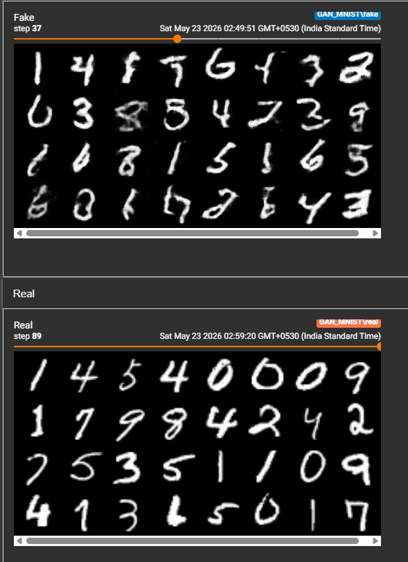
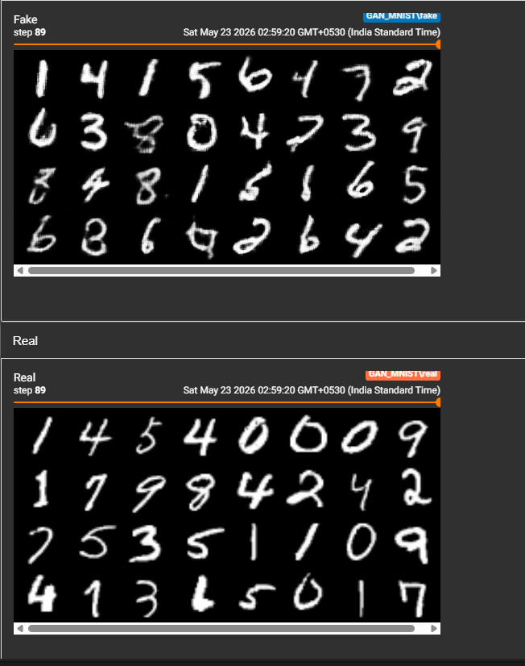

# WGAN-GP — MNIST

A from-scratch implementation of Wasserstein GAN with Gradient Penalty (WGAN-GP) trained on MNIST using PyTorch, following the architecture from [Gulrajani et al. 2017](https://arxiv.org/abs/1704.00028).

Built as a direct follow-up to DCGAN to replace BCE loss with a theoretically grounded distance metric and eliminate the need for careful loss balancing.

---

## Results

### Early training (Step 37) — already recognizable digits
By step 37, G was producing diverse, readable digits across multiple classes with no mode collapse.

### Final output (Step 89)
Sharp, varied digits visually comparable to real MNIST samples.

---

## DCGAN vs WGAN-GP — Comparison

|  | DCGAN | WGAN-GP |
|---|---|---|
| Loss function | BCELoss | Wasserstein distance + gradient penalty |
| Output activation (D/C) | Sigmoid | None (unbounded critic scores) |
| Discriminator role | Binary classifier | Critic estimating Wasserstein distance |
| Normalization | BatchNorm | InstanceNorm |
| Training ratio | 1:1 (D:G) | 5:1 (critic:G) |
| Gradient constraint | None | Gradient penalty (λ=10) on interpolated samples |
| Optimizer betas | β1=0.5, β2=0.999 | β1=0.0, β2=0.9 |

---

## What WGAN-GP fixes over DCGAN

- **Meaningful loss metric** — critic loss approximates Wasserstein distance, so loss curves are actually interpretable. Negative critic loss = positive W-distance = critic successfully separating real from fake
- **No sigmoid saturation** — BCE gradients vanish when D is too confident; Wasserstein loss provides useful gradients even when the critic is strong
- **Gradient penalty over weight clipping** — original WGAN enforced the Lipschitz constraint via weight clipping, which causes capacity underuse. GP directly penalizes the gradient norm of the critic on interpolated samples instead
- **InstanceNorm replaces BatchNorm** — BatchNorm creates dependencies between samples in a batch, which corrupts the per-sample gradient computation that GP requires

---

## Training observations

Critic loss started at -111 (epoch 0) and stabilized to the -5 to -9 range from epoch 2 onwards — magnitude shrinking indicates the critic and generator settled into equilibrium rather than the critic running away.

Generator loss trended upward from ~63 to ~77 across 10 epochs, reflecting steady improvement in fooling the critic throughout training.

No mode collapse observed at any point. Compare to Vanilla GAN where D_loss crashed to ~0.09 while G_loss stayed high, confirming D dominance and permanent collapse.

---

## Architecture

### Critic
Input: `(N, 1, 64, 64)` grayscale image
